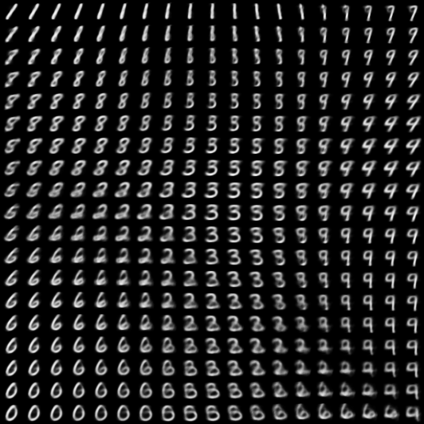
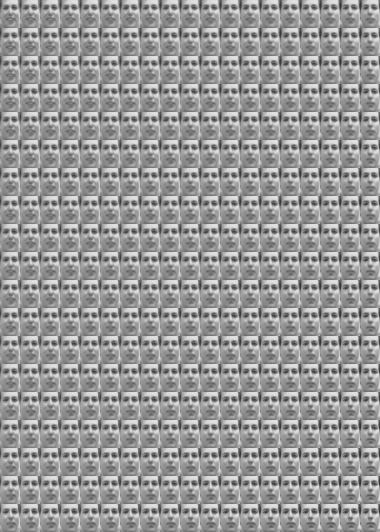

# vanilla_vae
Implementation of variational autoencoder (AEVB) algorithm, using Lasagne framework, as in:
[1] arXiv:1312.6114 [stat.ML] (Diederik P Kingma, Max Welling 2013)

A lot of codes is borrowed from
https://github.com/Lasagne/Recipes/blob/master/examples/variational_autoencoder/variational_autoencoder.py

Two experiments are performed on MNIST (Binary) and Frey Faces (continuous) datasets.

To run the training:
  1. you could change the network architecture in the config.json file
  2. run the command `python vae_train.py mnist` or `python vae_train.py faces`
 
After training, model parameters are stored and you could visualize the learned manifold by running 
`python vae_visualize.py mnist` or `python vae_visualize.py faces`

# Visualisations of learned data manifold with two-dimensional latent space learned with VAE
##  Learned MNIST manifold

## Learned Frey Faces manifold

